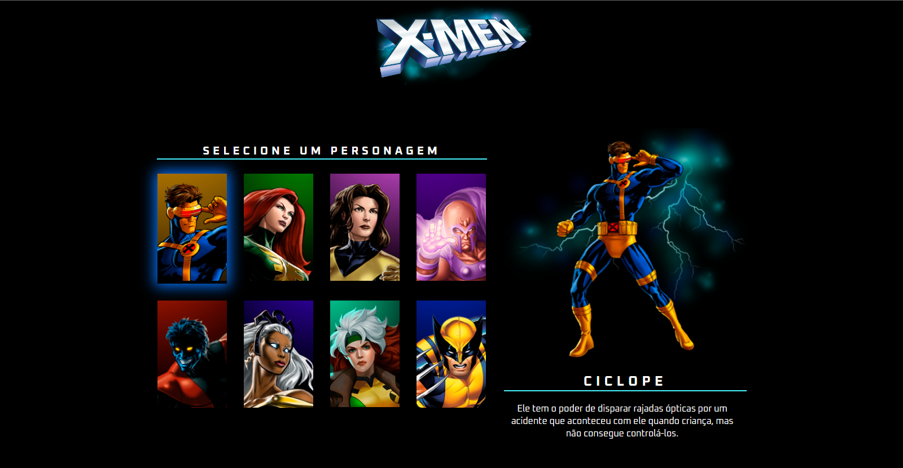

## 🖥️ Tela

## 📚 Projeto
Esse é um projeto WEB responsivo de um portfólio dos personagens da HQ de super-heróis X-MEN (Marvel Comics).

## 🚀 Tecnologias
Esse projeto foi desenvolvido durante o evento Live do Projeto 2 no canal do Dev em Dobro ["Nesse Link"](https://www.youtube.com/@DevemDobro) com as seguintes tecnologias:

 - HTML
 - CSS
 - JAVASCRIPT
 - GIT e GITHUB